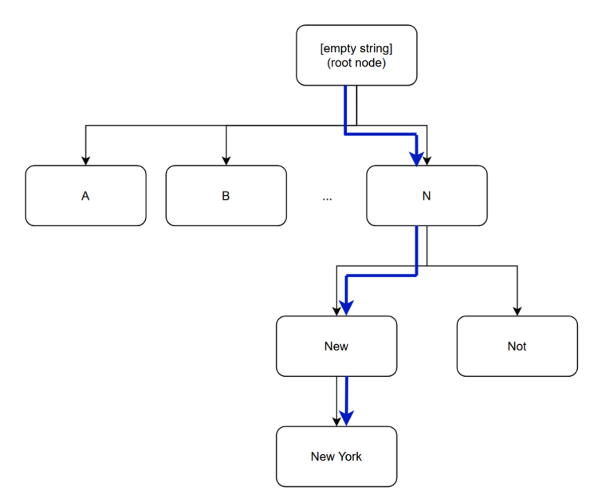
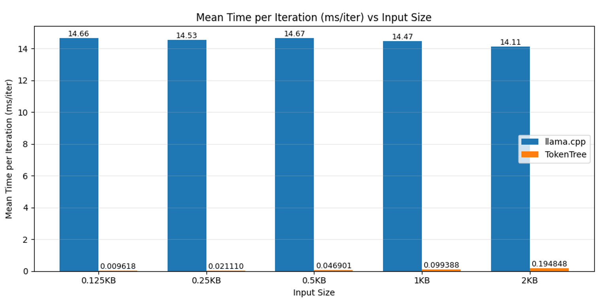
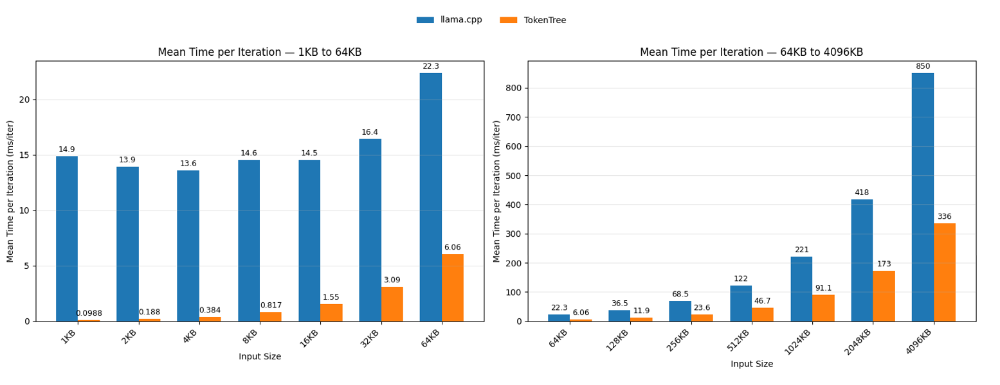

# Fast Inference-Time Tokenization through Approximating BPE

**Authors**

Gyula Rábai Jr., Ozeki Informatics Ltd, gyula.rabai.jr@ozeki.hu, https://gyularabai.com

**Abstract**

In the world of large language models (LLM), great emphasis has been placed on making high volume inference cost effective. Although this has largely been attempted through changing the underlying model architecture, an approach not yet sufficiently explored is making the surrounding infrastructure, such as tokenization, more efficient instead. In this paper, the author proposes a novel technique that yields greater performance for Byte-Pair Encoding (BPE) tokenization, which is widely used for LLM architectures such as Llama and GPT. This is achieved by noting that approximating the true tokenization output is sufficient for high quality output generation, and this can be done in linear time 100x faster than current solutions. Available on gyularabai.com.

PDF: https://gyularabai.com/attachments/9128/Gyula-Rabai-Fast-Tokenization.pdf

## 1. Introduction

Large language models (LLM) are gaining a large amount of attention in research due to their potential to automate tasks that require advance reasoning skills. However, deploying LLMs poses a great computational and therefore a great financial burden to the involved parties. This means that great efforts have been put forth to make LLM training and inference more efficient. (1) This paper will concern itself mainly with the latter, noting that many algorithms can be simplified compared to their training counterparts in model inference.

One notable example is how by using a key-value cache for the attention mechanism of transformer models, token generation can be improved by orders of magnitude. Indeed, most approaches to optimise LLM inference costs have been focused around creating more efficient models such as by introducing mixture of experts or applying quantization to the weights (5). Nonetheless, another approach to reduce computational burden is to improve the infrastructure supporting LLM inference such as tokenization.

The main tokenization algorithm used in most modern LLM architectures is Byte-Pair Encoding (BPE) (2). Some examples of architectures include the llama architecture which introduced BPE after the llama3 models (3) and the GPT models by OpenAI from GPT2 onwards (4). Most implementations aim to produce a perfect one-to-one match between the tokenization during training and the tokenization that takes place during inference. This is done by storing the pre-trained frequency scores for each merge and iteratively remerging the tokens until no more valid merges are feasible.

In this paper, a more efficient approach is used that leverages LLMs’ abilities to deal with infrequent tokenization errors (6). The reasoning behind this is that the key advantage of BPE compared to other tokenization algorithms is that it is able to handle out of vocabulary words through analysing the meaning of sub-word level character sequences.  Other evidence includes that relatively fragmented text sequences can still produce coherent results for bigram models. The approach proposed exploits this opportunity to create a tokenization algorithm that only produces an approximation, which it does very performantly.

## 2. Approach

The tokenization algorithm presented relies on the following three assumptions, which ensures that approximating the tokenization output of the training-time tokenizer is sufficient for LLMs to generate an output of reliable quality:

Shorter tokens, due to their higher frequency, will generally have to be merged before longer tokens.

Natural text has structures such as sentence marking punctuation and spaces that can reset an incorrect tokenization sequence if it occurs.

Finally, even if an incorrect sequence occurs, the sub-word level sequences can still be interpreted by the LLM to give a suitable result.

Assumption one guarantees that a greedy matching algorithm will generally produce the correct result, since this reduces the probability of a merge between two longer tokens being overlooked. Assumption one itself will be the case for most token vocabularies, since BPE merges the most common tokens first. This means it effectively iteratively substitutes more common, shorter tokens for less common, longer tokens each pass.

In case assumption one does not guarantee that a greedy token matching algorithm produces the correct result, assumption two means that natural text has features that naturally aid a greedy tokenizer in identifying clear token boundaries. Of the vocabulary used by the llama3.2 model, 57875 out of the 128256 tokens (~45%) start with a space, which means a greedy tokenizer would easily be able to use this natural marker in the text to identify the start of tokens. This is due to it being unlikely that such boundaries would be overextended by a previous, incorrectly chosen token thus resetting the sequence.

Thirdly, if these boundaries do not guarantee a correctly tokenized sequence, it can be confided in that the sub-word level sequences would still contain the information required. This is as per the original proposition of BPE in ‘Neural machine translation of rare words with subword units,’ and a later paper where Zheng et al. (6) verify this fact. Given these an algorithm can be constructed that uses these assumptions to more performantly tokenize short texts.

The specific algorithm proposed uses a decision tree like structure to linearly traverse the input string, always matching the largest token possible in a sequence. This can be chosen to be implemented by checking whether a sequence of merges is possible, where a tree of possible merges is built and traversed to find the longest possible match. Alternatively, this paper suggests to implement a simpler method where a tree of possible continuations of string (trie) is constructed of a vocabulary and then iterated as is done so below:

```
PROCEDURE FindNextToken(text, rootNode) RETURNS tokenId

	currentNode ← rootNode

	WHILE TRUE DO

		nextNode ← currentNode.NextContinuation(text)

		IF nextNode IS NULL THEN

			BREAK

		END IF

		currentNode ← nextNode

	END WHILE

	RETURN currentNode.ID

END PROCEDURE
```

In this instance, NextContinuation would be a function that uses a hash table to look up different lengths of the given string to either determine the next node or return null. Therefore, if the decision for selecting each branch of the tree has linear amortized time complexity, the entire process can be completed in linear time. The function presented above would be iteratively applied where the found token is removed from the text (a starting index incremented by the length of the found token) and provided to the function again in the next iteration. Figure 1 represents how this process would take place when tokenizing a text containing ‘New York’.

Figure 1, Example of Tree Traversal for ‘New York’
.

This compares to the algorithm used in implementations such as llama.cpp (7). In these implementations, a list of possible token merges is created in the form of a priority queue where the merge with the highest score is constantly applied and new merges are put in its place. This algorithm is applied until no more possible merges are present in the queue. This means multiple passes have to be done on the queue until it is empty, whereas the proposed algorithm can skip multiple merges by considering possible continuations at the price of rarely performing an invalid merge.

## 3. Method

To test the proposed algorithm a variety of texts were used from the Classic Literature in ASCII (8) dataset using a C# implementation, which was compared to llama.cpp’s tokenizer. llama.cpp is one of the most popular backends used for local LLM inference. Both tokenizers were using the llama3.2 model (9) in the GGUF format, which contains the token vocabulary as meta-data for the model. To fully ensure reproducibility, the source code for benchmarking the proposed approach is available on the following GitHub repository , and the solution to profile llama.cpp V1.0.4 includes the cuda dll for gmll, which is too large for GitHub, therefore this is available separately on gyularabai.com.

Note for reproducibility: the directory to the text files used to test the algorithms in both cases have to be rewritten to point to a directory with .txt files in it. This will differ for each tester.

The tokenizers were tested against each other for texts of sizes of 0.125KB 0.25KB, 0.5KB, 1KB, and 2KB to simulate lower prompt sizes for LLMs. Alternatively, to simulate larger system prompts and files, the sizes of 1KB, 2KB, 4KB etc. up to 4MBs were used. This was done by selecting the files large enough to accommodate for the given size, which were then truncated. Both solutions were tested using Benchmark.net. The machine used had an Intel Core Ultra 7 265K CPU, which is what all the benchmarks ran on.

## 4. Results

For the text inputs that simulate smaller prompt sizes, it seems that llama.cpp says around 14ms per iteration, this may be due to some overhead that remains constant regardless of the number of inputs. Due to the lack of such an overhead, the TokenTree algorithm is often many orders of magnitudes faster. Therefore for prompts below 128 bytes such as simple one-sentence questions, the proposed algorithm is around 1000 times faster. As the number of inputs scales exponentially, so does the amount of time taken (as one would expect for linear time complexity), therefore by 2KB, which is a couple paragraphs the advantage reduces to a 100x increase in speed. This is illustrated by the figure below:

Figure 2, Mean Time per Iteration for Small Input Sizes
.

Table 1 shows that the distribution of the data collected is relatively fixed between around a few 10s of milliseconds per 10000 or 100 iterations respectively, therefore it is unlikely that performance fluctuations form the environment impacted the data greatly. Due to the great difference in performance, llama.cpp had to be tested with fewer iterations for the results to be produced in the time limit available.

Table 1, Results for Small Input Texts


| TokenTree |  |  |  |  |  |
| --- | --- | --- | --- | --- | --- |
| Data Size (KB) | Iterations | Mean (ms) | Error (ms) | StdDev (ms) | Mean per Iter (ms/iter) |
| 0.125 | 10000 | 96.18 | 1.885 | 2.244 | 0.009618 |
| 0.25 | 10000 | 211.1 | 4.097 | 4.384 | 0.02111 |
| 0.5 | 10000 | 469.01 | 9.293 | 11.413 | 0.046901 |
| 1 | 10000 | 993.88 | 17.802 | 29.249 | 0.099388 |
| 2 | 10000 | 1948.48 | 20.624 | 19.292 | 0.194848 |
| llama.cpp |  |  |  |  |  |
| Data Size (KB) | Iterations | Mean (s) | Error (s) | StdDev (s) | Mean per Iter (ms/iter) |
| 0.125 | 100 | 1.466 | 0.0057 | 0.0054 | 14.66 |
| 0.25 | 100 | 1.453 | 0.009 | 0.0079 | 14.53 |
| 0.5 | 100 | 1.467 | 0.0137 | 0.0128 | 14.67 |
| 1 | 100 | 1.447 | 0.0108 | 0.0101 | 14.47 |
| 2 | 100 | 1.411 | 0.0063 | 0.0056 | 14.11 |

As the TokenTree approach catches up to the overhead, both algorithms scale proportionately to the amount of data provided. However, TokenTree does so at a slower rate as can be seen in figure 3 where even for texts exceeding 4MB the TokenTree algorithm outperforms llama.cpp by around a factor of 3.

Figure 3, Mean Time per Iteration for Large Input Sizes
.

The llama.cpp’s constant overhead lasts until around 16KB, where the first meaningful increment in the amount of time required to perform one full tokenization of the 16KB input occurs. As the speed of the tokenization slowed, the number of iterations performed at once was decreased. Table 2 demonstrates how the decrements were made.

Table 2, Results for Large Input Texts


| TokenTree |  |  |  |  |  |
| --- | --- | --- | --- | --- | --- |
| Data Size (KB) | Iterations | Mean (ms) | Error (ms) | StdDev (ms) | Mean per Iter (ms/iter) |
| 1 | 10000 | 988.50 | 19.25 | 18.9 | 0.09885 |
| 2 | 10000 | 1,878.40 | 18.11 | 15.12 | 0.18784 |
| 4 | 10000 | 3,842.30 | 30.9 | 27.39 | 0.38423 |
| 8 | 1000 | 816.50 | 14.29 | 13.37 | 0.8165 |
| 16 | 1000 | 1,550.70 | 14.71 | 13.04 | 1.5507 |
| 32 | 1000 | 3,092.50 | 28.93 | 27.06 | 3.0925 |
| 64 | 1000 | 6,058.40 | 39.8 | 37.23 | 6.0584 |
| 128 | 100 | 1,185.90 | 17.15 | 16.04 | 11.859 |
| 256 | 100 | 2,357.60 | 32.94 | 30.81 | 23.576 |
| 512 | 100 | 4,674.50 | 50.65 | 47.38 | 46.745 |
| 1024 | 10 | 911.20 | 16.7 | 15.62 | 91.12 |
| 2048 | 10 | 1,730.70 | 30.04 | 28.1 | 173.07 |
| 4096 | 10 | 3,359.10 | 21.48 | 20.1 | 335.91 |
| llama.cpp |  |  |  |  |  |
| Data Size (KB) | Iterations | Mean (ms) | Error (ms) | StdDev (ms) | Mean per Iter (ms/iter) |
| 1 | 100 | 1,486.00 | 6.71 | 5.95 | 14.86 |
| 2 | 100 | 1,390.70 | 17.72 | 14.79 | 13.907 |
| 4 | 100 | 1,356.50 | 26.49 | 30.51 | 13.565 |
| 8 | 100 | 1,455.00 | 57.32 | 51.21 | 14.55 |
| 16 | 100 | 1,451.90 | 12.26 | 11.47 | 14.519 |
| 32 | 100 | 1,643.10 | 32.46 | 30.36 | 16.431 |
| 64 | 100 | 2,233.80 | 20.67 | 17.26 | 22.338 |
| 128 | 100 | 3,654.90 | 72.98 | 68.27 | 36.549 |
| 256 | 10 | 685 | 13.23 | 13 | 68.5 |
| 512 | 10 | 1,215.10 | 23.53 | 30.59 | 121.51 |
| 1024 | 10 | 2,209.40 | 42.25 | 45.21 | 220.94 |
| 2048 | 1 | 418.4 | 16.58 | 48.9 | 418.4 |
| 4096 | 1 | 849.7 | 44.24 | 130.45 | 849.7 |

## 5. Conclusions

Overall, this paper demonstrated that by using an approach to approximate the true tokenization function significant gains can be achieved over traditional implementations over the text input ranges that LLMs face from users. Under common circumstances such as texts of under 2KBs, the proposed TokenTree algorithm can increase the performance of tokenization by over 100x. Therefore, further emphasis should be placed on researching more efficient tokenization algorithms to reduce costs for large scale deployment of LLMs.

## 6. References and Citations

1 Shams, D., Salama, I., & Callixtus, I. (2025). Exploring the Landscape of Large and Small Language Models: Advancements, Trade-offs, and Future Directions.

2 Sennrich, R., Haddow, B., & Birch, A. (2016, August). Neural machine translation of rare words with subword units. In Proceedings of the 54th annual meeting of the association for computational linguistics (volume 1: long papers) (pp. 1715-1725).

3 Grattafiori, A., Dubey, A., Jauhri, A., Pandey, A., Kadian, A., Al-Dahle, A., ... & Vasic, P. (2024). The llama 3 herd of models. arXiv preprint arXiv:2407.21783.

4 Radford, A., Wu, J., Child, R., Luan, D., Amodei, D., & Sutskever, I. (2019). Language models are unsupervised multitask learners. OpenAI blog, 1(8), 9.

5 Liu, J., Tang, P., Wang, W., Ren, Y., Hou, X., Heng, P. A., ... & Li, C. (2024). A survey on inference optimization techniques for mixture of experts models. arXiv preprint arXiv:2412.14219.

6 Zheng, B. S., Liu, A., Ahia, O., Hayase, J., Choi, Y., & Smith, N. A. Broken Tokens? Your Language Model can Secretly Handle Non-Canonical Tokenizations.

7 G. Gerganov, LLama.cpp Github Respository, Retrieved January 4, 2026, https://github.com/ggml-org/llama.cpp

8 O’Neill, M. (n.d.). Classic Literature in ASCII [Data set]. Kaggle. Retrieved January 4, 2026, from https://www.kaggle.com/datasets/mylesoneill/classic-literature-in-ascii

9 Bartowski. (n.d.).  (f16) [Machine learning model]. Hugging Face. Retrieved January 4, 2026, from https://huggingface.co/bartowski/Llama-3.2-1B-Instruct-GGUF


